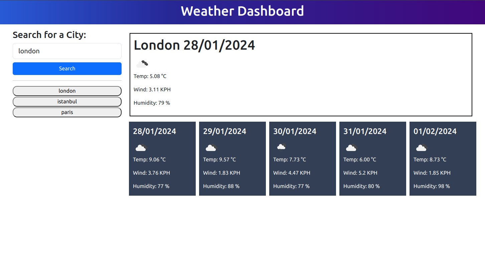
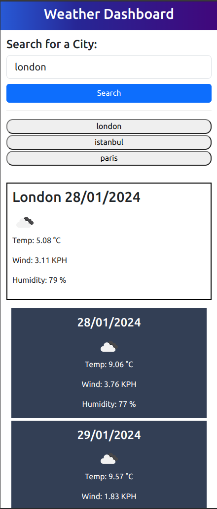

# Weather Forecast Application

A simple weather forecast application that provides current weather information and a 5-day forecast for a given city.

## Table of Contents

- [Weather Forecast Application](#weather-forecast-application)
  - [Table of Contents](#table-of-contents)
  - [Description](#description)
  - [Features](#features)
  - [Usage](#usage)
  - [Demo](#demo)
  - [Contributing](#contributing)
  - [License](#license)

## Description

The Weather Forecast Application allows users to retrieve current weather details and a 5-day forecast for a specified city. It utilizes the OpenWeatherMap API to fetch real-time weather data.

## Features

- Current weather information display
- 5-day weather forecast display
- Search for weather data by city
- Responsive design for various devices

## Usage

1. Enter the city name in the search bar.
2. Click the "Search" button.
3. View the current weather details and the 5-day forecast for the specified city.

## Demo

### Live Demo

Visit the live demo of the Weather Forecast Application [here](https://mdtoy-dev.github.io/weather-forecast/).

### Screenshots

#### Desktop View

#### Mobile View

## Contributing

Contributions are welcome! Follow these steps to contribute:

1. Fork the project.
2. Create a new branch (`git checkout -b feature/your-feature`).
3. Commit your changes (`git commit -am 'Add some feature'`).
4. Push to the branch (`git push origin feature/your-feature`).
5. Open a pull request.

## License

This Weather Forecast Application is licensed under the [MIT License](LICENSE.md).
